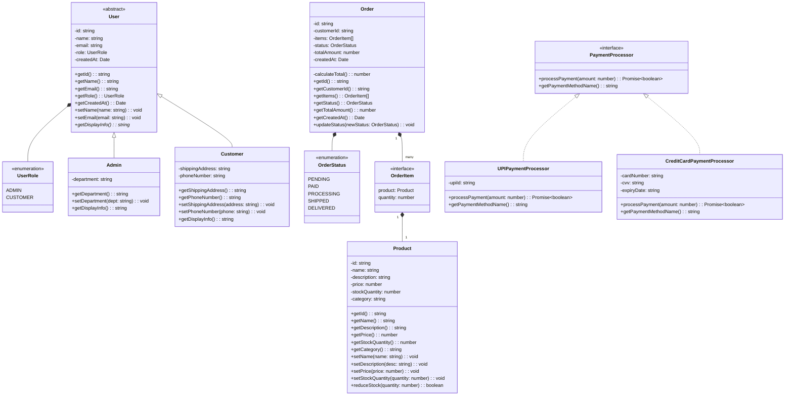

# ShopCore Class Diagram

```mermaid
classDiagram
    %% User Hierarchy
    class User {
        <<abstract>>
        -id: string
        -name: string
        -email: string
        -role: UserRole
        -createdAt: Date
        +getId(): string
        +getName(): string
        +getEmail(): string
        +getRole(): UserRole
        +getCreatedAt(): Date
        +setName(name: string): void
        +setEmail(email: string): void
        +getDisplayInfo(): string*
    }

    class UserRole {
        <<enumeration>>
        ADMIN
        CUSTOMER
    }

    class Admin {
        -department: string
        +getDepartment(): string
        +setDepartment(dept: string): void
        +getDisplayInfo(): string
    }

    class Customer {
        -shippingAddress: string
        -phoneNumber: string
        +getShippingAddress(): string
        +getPhoneNumber(): string
        +setShippingAddress(address: string): void
        +setPhoneNumber(phone: string): void
        +getDisplayInfo(): string
    }

    %% Product Class
    class Product {
        -id: string
        -name: string
        -description: string
        -price: number
        -stockQuantity: number
        -category: string
        +getId(): string
        +getName(): string
        +getDescription(): string
        +getPrice(): number
        +getStockQuantity(): number
        +getCategory(): string
        +setName(name: string): void
        +setDescription(desc: string): void
        +setPrice(price: number): void
        +setStockQuantity(quantity: number): void
        +reduceStock(quantity: number): boolean
    }

    %% Order Classes
    class Order {
        -id: string
        -customerId: string
        -items: OrderItem[]
        -status: OrderStatus
        -totalAmount: number
        -createdAt: Date
        -calculateTotal(): number
        +getId(): string
        +getCustomerId(): string
        +getItems(): OrderItem[]
        +getStatus(): OrderStatus
        +getTotalAmount(): number
        +getCreatedAt(): Date
        +updateStatus(newStatus: OrderStatus): void
    }

    class OrderStatus {
        <<enumeration>>
        PENDING
        PAID
        PROCESSING
        SHIPPED
        DELIVERED
    }

    class OrderItem {
        <<interface>>
        product: Product
        quantity: number
    }

    %% Payment Strategy Pattern
    class PaymentProcessor {
        <<interface>>
        +processPayment(amount: number): Promise~boolean~
        +getPaymentMethodName(): string
    }

    class UPIPaymentProcessor {
        -upiId: string
        +processPayment(amount: number): Promise~boolean~
        +getPaymentMethodName(): string
    }

    class CreditCardPaymentProcessor {
        -cardNumber: string
        -cvv: string
        -expiryDate: string
        +processPayment(amount: number): Promise~boolean~
        +getPaymentMethodName(): string
    }

    %% Relationships
    User <|-- Admin
    User <|-- Customer
    User *-- UserRole
    Order *-- OrderStatus
    Order "1" *-- "many" OrderItem
    OrderItem "1" *-- "1" Product
    PaymentProcessor <|.. UPIPaymentProcessor
    PaymentProcessor <|.. CreditCardPaymentProcessor
```
