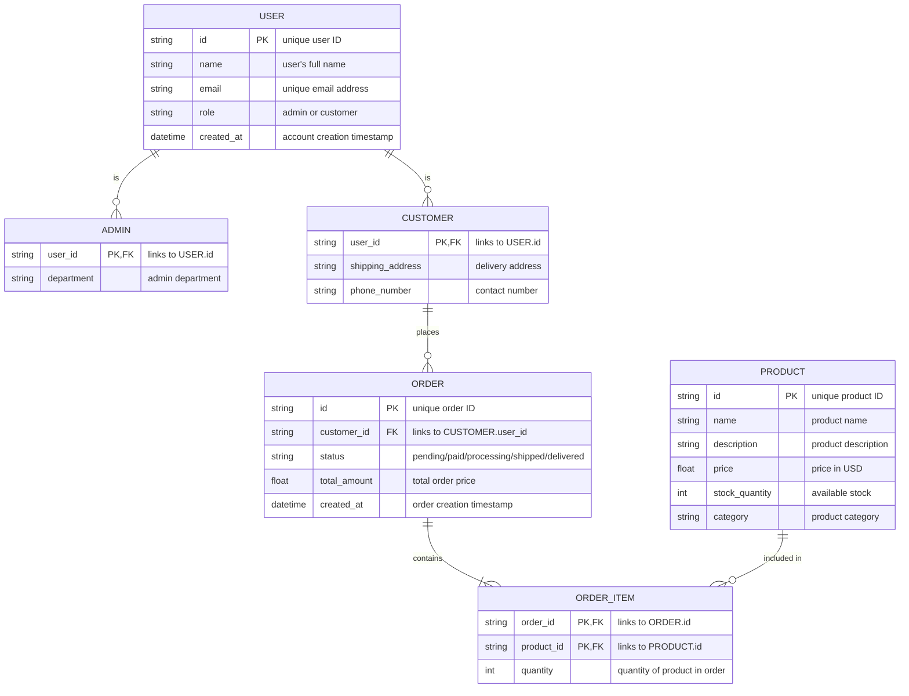

# ShopCore ER Diagram (Entity-Relationship Diagram)

```mermaid
erDiagram
    %% User Entity (Supertype)
    USER {
        string id PK "unique user ID"
        string name "user's full name"
        string email "unique email address"
        string role "admin or customer"
        datetime created_at "account creation timestamp"
    }

    %% Admin Entity (Subtype of USER)
    ADMIN {
        string user_id PK, FK "links to USER.id"
        string department "admin department"
    }

    %% Customer Entity (Subtype of USER)
    CUSTOMER {
        string user_id PK, FK "links to USER.id"
        string shipping_address "delivery address"
        string phone_number "contact number"
    }

    %% Product Entity
    PRODUCT {
        string id PK "unique product ID"
        string name "product name"
        string description "product description"
        float price "price in USD"
        int stock_quantity "available stock"
        string category "product category"
    }

    %% Order Entity
    ORDER {
        string id PK "unique order ID"
        string customer_id FK "links to CUSTOMER.user_id"
        string status "pending/paid/processing/shipped/delivered"
        float total_amount "total order price"
        datetime created_at "order creation timestamp"
    }

    %% Order Item (Junction Table for Order-Product Many-to-Many)
    ORDER_ITEM {
        string order_id PK, FK "links to ORDER.id"
        string product_id PK, FK "links to PRODUCT.id"
        int quantity "quantity of product in order"
    }

    %% Relationships
    USER ||--o{ ADMIN : "is"
    USER ||--o{ CUSTOMER : "is"
    CUSTOMER ||--o{ ORDER : "places"
    ORDER ||--|{ ORDER_ITEM : "contains"
    PRODUCT ||--o{ ORDER_ITEM : "included in"
```
