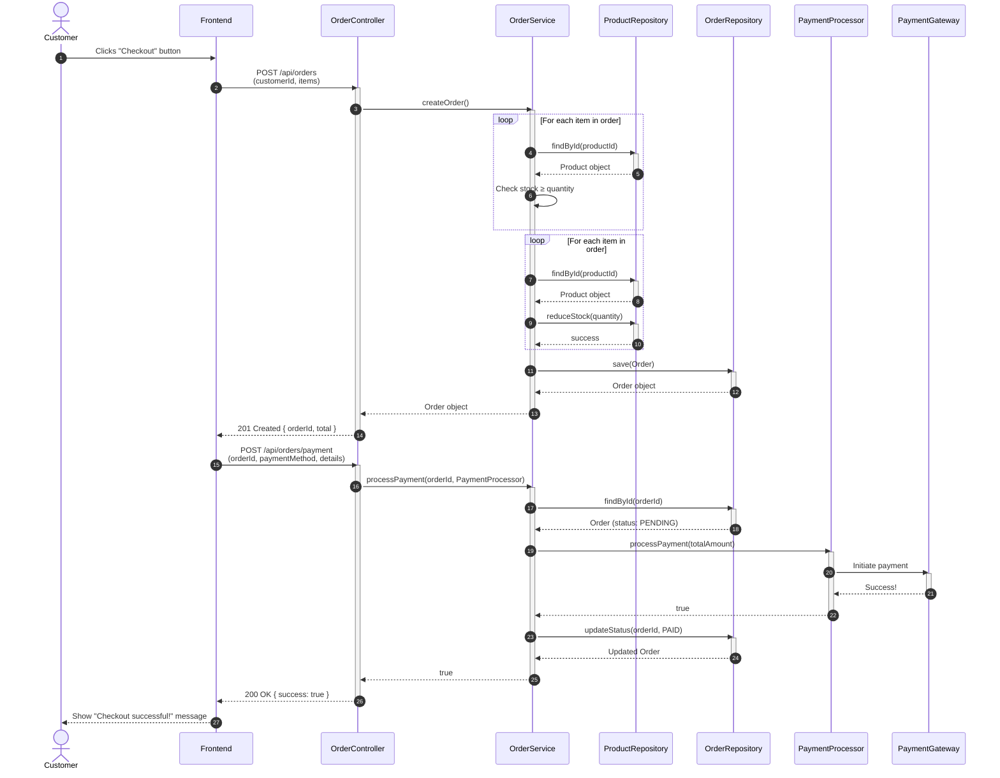

# ShopCore Sequence Diagram (Checkout & Payment Flow)

```mermaid
sequenceDiagram
    autonumber
    actor Customer
    participant Frontend
    participant OrderController
    participant OrderService
    participant ProductRepository
    participant OrderRepository
    participant PaymentProcessor
    participant PaymentGateway

    Customer->>Frontend: Clicks "Checkout" button
    Frontend->>OrderController: POST /api/orders<br/>(customerId, items)
    activate OrderController
    OrderController->>OrderService: createOrder()
    activate OrderService

    %% Stock Validation Loop
    loop For each item in order
        OrderService->>ProductRepository: findById(productId)
        activate ProductRepository
        ProductRepository-->>OrderService: Product object
        deactivate ProductRepository
        OrderService->>OrderService: Check stock ≥ quantity
    end

    %% Stock Reduction Loop
    loop For each item in order
        OrderService->>ProductRepository: findById(productId)
        activate ProductRepository
        ProductRepository-->>OrderService: Product object
        deactivate ProductRepository
        OrderService->>ProductRepository: reduceStock(quantity)
        activate ProductRepository
        ProductRepository-->>OrderService: success
        deactivate ProductRepository
    end

    %% Create Order
    OrderService->>OrderRepository: save(Order)
    activate OrderRepository
    OrderRepository-->>OrderService: Order object
    deactivate OrderRepository
    OrderService-->>OrderController: Order object
    deactivate OrderService
    OrderController-->>Frontend: 201 Created { orderId, total }
    deactivate OrderController

    %% Payment Processing
    Frontend->>OrderController: POST /api/orders/payment<br/>(orderId, paymentMethod, details)
    activate OrderController
    OrderController->>OrderService: processPayment(orderId, PaymentProcessor)
    activate OrderService
    OrderService->>OrderRepository: findById(orderId)
    activate OrderRepository
    OrderRepository-->>OrderService: Order (status: PENDING)
    deactivate OrderRepository

    %% Strategy Pattern in Action!
    OrderService->>PaymentProcessor: processPayment(totalAmount)
    activate PaymentProcessor
    PaymentProcessor->>PaymentGateway: Initiate payment
    activate PaymentGateway
    PaymentGateway-->>PaymentProcessor: Success!
    deactivate PaymentGateway
    PaymentProcessor-->>OrderService: true
    deactivate PaymentProcessor

    %% Update Order Status
    OrderService->>OrderRepository: updateStatus(orderId, PAID)
    activate OrderRepository
    OrderRepository-->>OrderService: Updated Order
    deactivate OrderRepository
    OrderService-->>OrderController: true
    deactivate OrderService
    OrderController-->>Frontend: 200 OK { success: true }
    deactivate OrderController

    Frontend-->>Customer: Show "Checkout successful!" message
```
